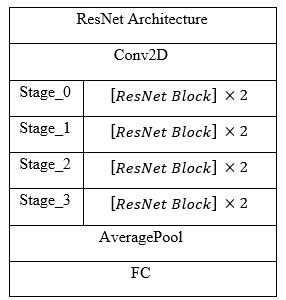
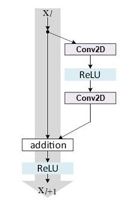

# Traffic-Signs-Classification-via-ResNet

In this project, I tried to do the traffic signs classification task. For this task, I implemented a simple ResNet by implementing residual block. 

 
 

<h3> ResNet block architecture<h3>

 
 

<h3>Model's architecture</h3>

